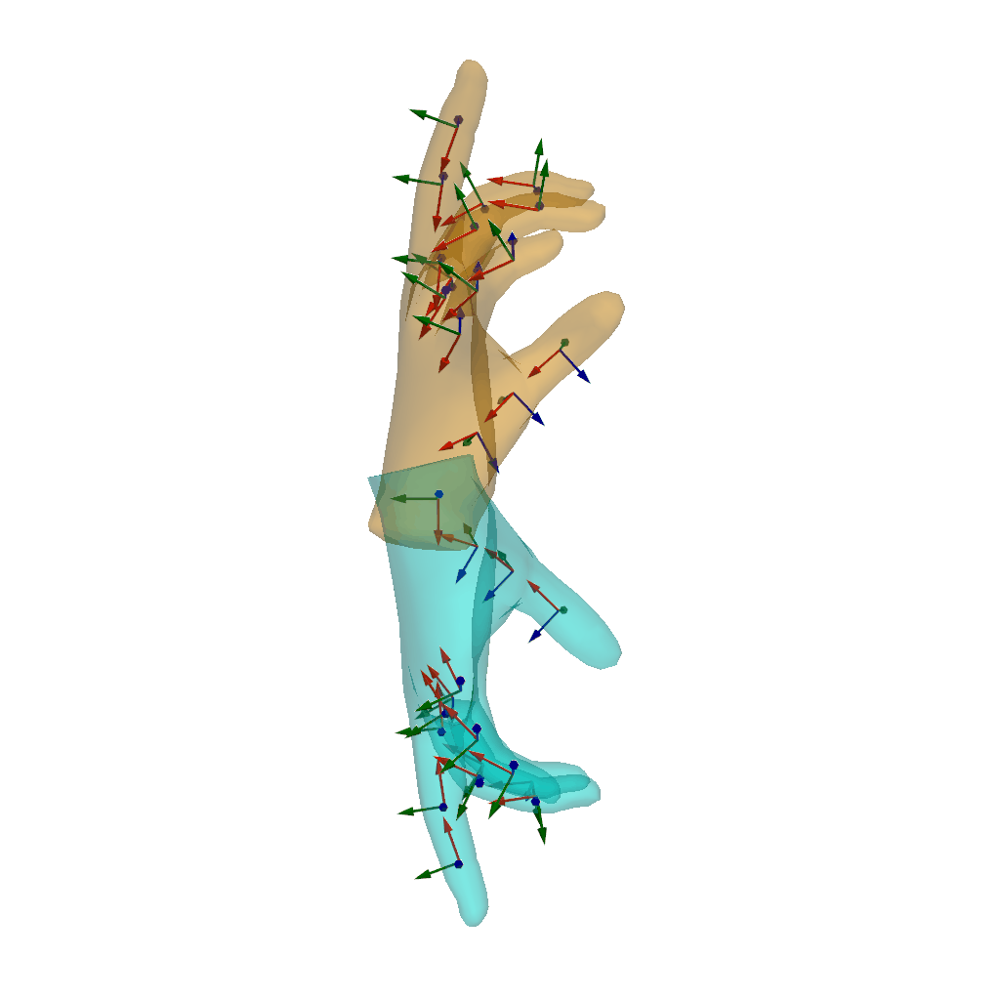
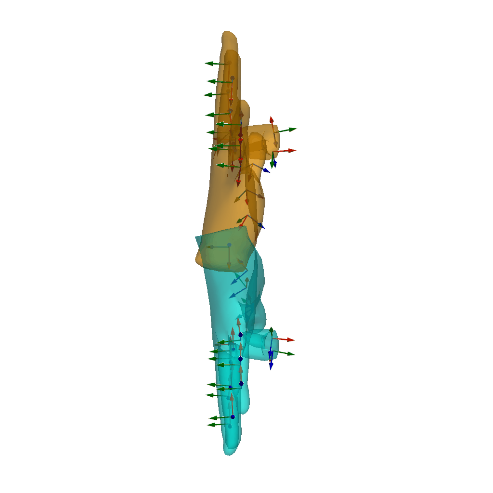
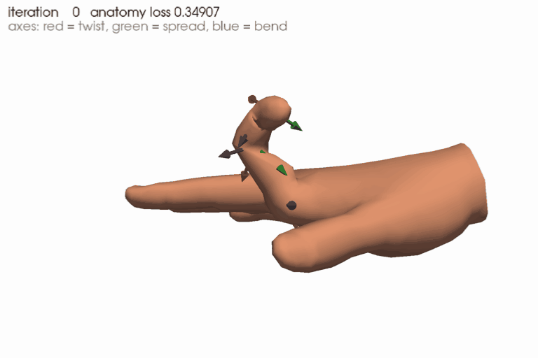

# manotorch: MANO Pytorch

[](https://docs.python.org/3.12)
[](https://pytorch.org/)
[](https://developer.nvidia.com/cuda-12-6-0-download-archive)
[](LICENSE)

> [!NOTE]
> This repository is an optimized fork of [lixiny/manotorch](https://github.com/lixiny/manotorch), maintained by [IRVLUTD](https://github.com/IRVLUTD) for MANO hand research.
> The original design and implementation are the work of the upstream authors. All changes made in this fork are listed in [CHANGELOG.md](CHANGELOG.md).

manotorch is a differentiable PyTorch layer that deterministically maps MANO pose and shape parameters to hand joints and vertices. It can be integrated into any architecture as a differentiable layer to predict hand meshes.

- Compatible with Yana's [manopth](https://github.com/hassony2/manopth) and Omid's [MANO](https://github.com/otaheri/MANO) packages, see [test_compatibility](scripts/test_compatibility.ipynb).
- Extends manopth with the Anatomical Consistent Basis, Anatomy Loss, hand composition from Euler angles, and anchor interpolation, for both the left and right hand.

## Installation

### Get the code

```shell
git clone https://github.com/IRVLUTD/manotorch.git
cd manotorch
```

### Option 1: uv (recommended)

[uv](https://docs.astral.sh/uv/) creates a `.venv/` with Python 3.12 and PyTorch 2.11.0 (CUDA 12.6), using the exact versions locked in [uv.lock](uv.lock). manotorch is installed in editable mode together with the development tools (pytest, ruff):

```shell
uv sync                  # core dependencies + dev tools
uv sync --extra vis      # + open3d, pyvista, trimesh, tqdm for the demo scripts
```

Run commands inside the environment with `uv run`, e.g. `uv run python scripts/simple_app.py`, or activate it with `source .venv/bin/activate`. Run the tests with `uv run pytest` (they need the MANO model files, see below; set `MANO_ASSETS_ROOT` if they are not under `assets/mano`).

### Option 2: existing environment

Install [PyTorch](https://pytorch.org/get-started/locally/) for your CUDA version first, then install manotorch with pip (or `uv pip`):

```shell
python -m pip install -e .            # core dependencies only
python -m pip install -e ".[vis]"     # + open3d, pyvista, trimesh, tqdm for the demo scripts
```

To use manotorch as a dependency of another project: `python -m pip install "git+https://github.com/IRVLUTD/manotorch.git"`.

manotorch is configured entirely through [pyproject.toml](pyproject.toml), so a regular `pip install` works without any extra build flags. chumpy is not required.

### Download the MANO model

1. Register on the [MANO website](https://mano.is.tue.mpg.de/) and download _Models & Code_ (`mano_v*_*.zip`).
   Everything in this download is covered by the [MANO license](https://mano.is.tue.mpg.de/license), not by this repository's license.
2. Unzip it and copy the contents of `mano_v*_*/` into `assets/mano/` (or pass another location through `mano_assets_root`). Only the two model files are used:

   ```
   assets/mano
   └── models
       ├── MANO_LEFT.pkl
       └── MANO_RIGHT.pkl
   ```

   The original pickles are read directly with numpy, through a restricted unpickler that refuses anything but the
   numpy, chumpy and scipy data a MANO file contains; chumpy and scipy are not needed.
3. (Optional) Convert them to `.npz` files, which load without pickle and faster. `ManoLayer` uses `MANO_{SIDE}.npz`
   when it exists and falls back to `MANO_{SIDE}.pkl`; both give bit-identical outputs. The converter needs scipy:

   ```shell
   uv run --with scipy python tools/mano_pkl_to_npz.py --input_file assets/mano/models/MANO_RIGHT.pkl
   uv run --with scipy python tools/mano_pkl_to_npz.py --input_file assets/mano/models/MANO_LEFT.pkl
   ```

The MANO model files must never be committed to this repository; `assets/mano/` is git-ignored.

## Usage

```python
import torch
from manotorch.manolayer import ManoLayer, MANOOutput

ncomps = 15  # number of PCA components for the pose space
mano_layer = ManoLayer(side="right", use_pca=True, flat_hand_mean=False, ncomps=ncomps, center_idx=0)

batch_size = 2
random_shape = torch.rand(batch_size, 10)
random_pose = torch.rand(batch_size, 3 + ncomps)  # 3 values for the global axis-angle rotation

mano_output: MANOOutput = mano_layer(random_pose, random_shape)

# In meters, relative to joint `center_idx` (no centering when center_idx is None)
verts = mano_output.verts                    # (B, 778, 3)
joints = mano_output.joints                  # (B, 21, 3)
transforms_abs = mano_output.transforms_abs  # (B, 16, 4, 4)
```

### Left hand

`ManoLayer(side="left")` reproduces the official left-hand model by default. That model ships the right-hand shape
blend shapes without mirroring their x component ([smplx#48](https://github.com/vchoutas/smplx/issues/48)), so with
non-zero betas a left hand is not the mirror of the right hand with the same betas. Joint rotations are not affected.

- Keep the default to consume data fitted with the official model, e.g. with manopth or smplx (HO-Cap, ...).
- Pass `fix_left_shapedirs=True` for new work where both hands share betas, or where poses are mirrored between hands.

The anatomy aligned Euler angles of `AxisLayerFK` (twist, spread, bend) follow the same convention for both hands:
a left-hand pose mirrored from a right-hand pose gives the same angles, `compose()` takes them back for either hand,
and the `AnatomyConstraintLossEE` limits apply in the same anatomical direction.

### Speed

The layer has no host-device synchronization and compiles into a single graph. On small batches the eager GPU time is
dominated by kernel launches, which `torch.compile` removes:

```python
mano_layer = torch.compile(ManoLayer(...).cuda(), mode="reduce-overhead")  # CUDA graphs; fixed input shapes
```

### Reading the MANO training poses

The MANO website provides the poses the model was trained with (_Training Scans Registrations_). They load with
`manotorch.utils.mano_io.load_mano_pickle` and are reproduced exactly (to 1e-16 m in float64) by:

| Data | How to evaluate it |
| --- | --- |
| `handsOnly_REGISTRATIONS_r_lm___POSES/*.pkl`: `pose` (48,), `betas`, `trans`, all right hands (left ones mirrored) | `ManoLayer(side="right", use_pca=False, flat_hand_mean=True)(pose, betas).verts + trans` equals `v`; `transforms_abs[..., :3, 3] + trans` equals `J_transformed` |
| `handsOnly_REGISTRATIONS_r_lm___POSES___{R,L}.npy`: (1554, 45) articulation only | prepend 3 zeros for the global rotation; `L` is `R` mirrored for the left model, i.e. the y and z components of each joint's axis-angle negated |
| synthetic sequences `handPose_*.pkl`: lists of (78,) vectors, `[0:66]` all zero | no metadata ships with them; they match the SMPL+H pose layout of the official code (66 body values, then 6 PCA coefficients of the left hand `[66:72]` and of the right hand `[72:78]`, `flat_hand_mean=False` by default): `ManoLayer(side=..., use_pca=True, ncomps=6, flat_hand_mean=False)` with 3 zeros prepended. With `flat_hand_mean=False` the poses lie as close to the training poses as 6 PCA components allow |

### Demos

| [Visualize](scripts/simple_app.py) | [Compose Hand](scripts/simple_compose.py) | [Error Correction](scripts/simple_anatomy_loss.py) |
| :--------------------------------: | :---------------------------------------: | :------------------------------------------------: |
|               |            |                        |

Detailed documentation of the [Anatomical Consistent Basis](README.old.md#anatomical-consistent-basis), [Anatomy Loss](README.old.md#anatomy-loss), [Composing the Hand](README.old.md#composing-the-hand) and [Anchor Interpolation](README.old.md#anchor-interpolation) is kept in [README.old.md](README.old.md) until it is rewritten for this fork.

## License

- The manotorch code is licensed under the [GNU General Public License v3.0](LICENSE), inherited from upstream [manotorch](https://github.com/lixiny/manotorch) and [manopth](https://github.com/hassony2/manopth). Redistributed or modified versions must remain under GPL-3.0.
- This repository no longer contains any file of the official MANO release (the `mano/webuser` code bundled by upstream was removed).
- The MANO model files (`MANO_*.pkl`, and the `.npz` files converted from them) are subject to the MANO license and are not distributed with this repository.
- Third-party code included in manotorch keeps its original notice: [`manotorch/utils/geometry.py`](manotorch/utils/geometry.py) is adapted from [PyTorch3D](https://github.com/facebookresearch/pytorch3d) (BSD 3-Clause).

## Acknowledgements

This fork builds on [manotorch](https://github.com/lixiny/manotorch) by Lixin Yang and contributors, which in turn is modified from [manopth](https://github.com/hassony2/manopth) by Yana Hasson. We thank the authors of [MANO](https://mano.is.tue.mpg.de/), [PyTorch3D](https://github.com/facebookresearch/pytorch3d), [Ceres Solver](https://github.com/ceres-solver/ceres-solver) and [pytorch_HMR](https://github.com/MandyMo/pytorch_HMR).

## Citation

If you find manotorch useful in your research, please cite CPF, where manotorch was originally developed:

```bibtex
@inproceedings{yang2021cpf,
    title = {{CPF}: Learning a Contact Potential Field to Model the Hand-Object Interaction},
    author = {Yang, Lixin and Zhan, Xinyu and Li, Kailin and Xu, Wenqiang and Li, Jiefeng and Lu, Cewu},
    booktitle = {ICCV},
    year = {2021}
}
```

and the original MANO publication:

```bibtex
@article{MANO:SIGGRAPHASIA:2017,
    title = {Embodied Hands: Modeling and Capturing Hands and Bodies Together},
    author = {Romero, Javier and Tzionas, Dimitrios and Black, Michael J.},
    journal = {ACM Transactions on Graphics, (Proc. SIGGRAPH Asia)},
    publisher = {ACM},
    month = nov,
    year = {2017},
    url = {http://doi.acm.org/10.1145/3130800.3130883},
    month_numeric = {11}
}
```
