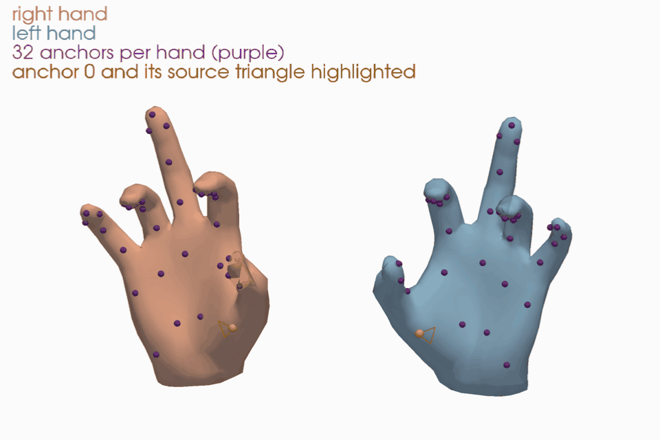

# manotorch: MANO Pytorch

[](https://docs.python.org/3.12)
[](https://pytorch.org/)
[](https://developer.nvidia.com/cuda-12-6-0-download-archive)
[](LICENSE)

> [!NOTE]
> This repository is an optimized fork of [lixiny/manotorch](https://github.com/lixiny/manotorch), maintained by [IRVLUTD](https://github.com/IRVLUTD) for MANO hand research.
> The original design and implementation are the work of the upstream authors. All changes made in this fork are listed in [CHANGELOG.md](CHANGELOG.md).

manotorch is a differentiable PyTorch layer that deterministically maps MANO pose and shape parameters to hand joints and vertices. It can be integrated into any architecture as a differentiable layer to predict hand meshes.

- Compatible with Yana's [manopth](https://github.com/hassony2/manopth) and Omid's [MANO](https://github.com/otaheri/MANO) packages, see [test_compatibility](scripts/test_compatibility.ipynb).
- Extends manopth with the Anatomical Consistent Basis, Anatomy Loss, hand composition from Euler angles, and anchor interpolation, for both the left and right hand.

## Installation

### Get the code

```shell
git clone https://github.com/IRVLUTD/manotorch.git
cd manotorch
```

### Option 1: uv (recommended)

[uv](https://docs.astral.sh/uv/) creates a `.venv/` with Python 3.12 and PyTorch 2.11.0 (CUDA 12.6), using the exact versions locked in [uv.lock](uv.lock). manotorch is installed in editable mode together with the development tools (pytest, ruff):

```shell
uv sync                  # core dependencies + dev tools
uv sync --extra vis      # + pyvista, trimesh, imageio, tqdm for the demo scripts
```

Run commands inside the environment with `uv run`, e.g. `uv run python scripts/simple_app.py`, or activate it with `source .venv/bin/activate`. Run full model validation with `uv run pytest --require-mano` (set `MANO_ASSETS_ROOT` if the models are not under
`assets/mano`). Plain `pytest -ra` skips model-dependent tests when the licensed files are missing and reports that
coverage gap. Public CPU CI exercises Python 3.10 / PyTorch 2.0.1 and Python 3.12 / PyTorch 2.11.0; licensed-model
and CUDA validation must run separately.

### Option 2: existing environment

Install [PyTorch](https://pytorch.org/get-started/locally/) for your CUDA version first, then install manotorch with pip (or `uv pip`):

```shell
python -m pip install -e .            # core dependencies only
python -m pip install -e ".[vis]"     # + pyvista, trimesh, imageio, tqdm for the demo scripts
```

With older PyTorch builds such as 2.0.1, use NumPy 1.x (`python -m pip install "numpy<2"`); their NumPy bridge is
incompatible with NumPy 2. The development lock uses PyTorch 2.11 and NumPy 2.

To use manotorch as a dependency of another project: `python -m pip install "git+https://github.com/IRVLUTD/manotorch.git"`.

For the reproducible **0.1.0** release, install from the tag:
`python -m pip install "git+https://github.com/IRVLUTD/manotorch.git@v0.1.0"`.
Wheel and source archives are available on [GitHub Releases](https://github.com/IRVLUTD/manotorch/releases/tag/v0.1.0).
See [release validation and publishing](doc/releasing.md) for the CI coverage and publishing procedure.

manotorch is configured entirely through [pyproject.toml](pyproject.toml), so a regular `pip install` works without any extra build flags. chumpy is not required.

### Download the MANO model

1. Register on the [MANO website](https://mano.is.tue.mpg.de/) and download _Models & Code_ (`mano_v*_*.zip`).
   Everything in this download is covered by the [MANO license](https://mano.is.tue.mpg.de/license), not by this repository's license.
2. Unzip it and copy the contents of `mano_v*_*/` into `assets/mano/` (or pass another location through `mano_assets_root`). Only the two model files are used:

   ```
   assets/mano
   └── models
       ├── MANO_LEFT.pkl
       └── MANO_RIGHT.pkl
   ```

   A flat model folder is also accepted. Legacy `MANO_{SIDE}_new.pkl` and `MANO_{SIDE}_np.pkl` files are fallbacks
   when neither the canonical NPZ nor pickle exists. The `models/` subfolder takes precedence over a flat folder.

   The original pickles are read directly with numpy, through a restricted unpickler that refuses anything but the
   numpy, chumpy and scipy data a MANO file contains; chumpy and scipy are not needed.
3. (Optional) Convert them to `.npz` files, which load without pickle. `ManoLayer` uses `MANO_{SIDE}.npz`
   when it exists and falls back to `MANO_{SIDE}.pkl`; both give bit-identical outputs. The converter needs scipy:

   ```shell
   uv run --with scipy python tools/mano_pkl_to_npz.py --input_file assets/mano/models/MANO_RIGHT.pkl
   uv run --with scipy python tools/mano_pkl_to_npz.py --input_file assets/mano/models/MANO_LEFT.pkl
   ```

The MANO model files must never be committed to this repository; `assets/mano/` is git-ignored.

## Usage

```python
import torch
from manotorch.manolayer import ManoLayer, MANOOutput

ncomps = 15  # number of PCA components for the pose space
mano_layer = ManoLayer(side="right", use_pca=True, flat_hand_mean=False, ncomps=ncomps, center_idx=0)

batch_size = 2
random_shape = torch.rand(batch_size, 10)
random_pose = torch.rand(batch_size, 3 + ncomps)  # 3 values for the global axis-angle rotation

mano_output: MANOOutput = mano_layer(random_pose, random_shape)

# In meters, relative to joint `center_idx` (no centering when center_idx is None);
# pass `transl` (B, 3) as third argument to place the hand: mano_layer(random_pose, random_shape, transl)
verts = mano_output.verts                    # (B, 778, 3)
joints = mano_output.joints                  # (B, 21, 3)
transforms_abs = mano_output.transforms_abs  # (B, 16, 4, 4)
```

### Left hand

`ManoLayer(side="left")` reproduces the official left-hand model by default. That model ships the right-hand shape
blend shapes without mirroring their x component ([smplx#48](https://github.com/vchoutas/smplx/issues/48)), so with
non-zero betas a left hand is not the mirror of the right hand with the same betas. Joint rotations are not affected.

- Keep the default to consume data fitted with the official model, e.g. with manopth or smplx (HO-Cap, ...).
- Pass `fix_left_shapedirs=True` for new work where both hands share betas, or where poses are mirrored between hands.

The anatomy aligned Euler angles of `AxisLayerFK` (twist, spread, bend) follow the same convention for both hands:
a left-hand pose mirrored from a right-hand pose gives the same angles, `compose()` takes them back for either hand,
and the `AnatomyConstraintLossEE` limits apply in the same anatomical direction. This recovers articulation;
`AxisLayerFK` does not encode the global wrist rotation, which callers must retain separately.

### Speed

`ManoLayer` runs in eager mode by default and does not compile itself. Keep eager as the default for general use,
changing input shapes, debugging and older environments. Callers can opt into compilation for repeated fixed-shape
GPU fitting after validating runtime and gradients in their target environment. Compiled fitting was measured with
PyTorch 2.11; these results do not establish compatibility across every supported PyTorch version and device.

The steady-state layer has no host-device synchronization and compiles into a single graph. On small batches,
kernel-launch overhead can dominate eager execution; `torch.compile` fuses those operations and can use CUDA graphs:

```python
mano_layer = ManoLayer(...).cuda()  # default: eager
# Optional for repeated fixed-shape GPU workloads:
mano_layer = torch.compile(mano_layer, mode="reduce-overhead")
```

Compilation adds a first-call cost and may repeat when shapes, dtype or configuration change.
`reduce-overhead` can retain extra CUDA workspace; graph breaks or unsupported autodiff operations can prevent
full-graph compilation. Fixed-shape repeated fitting can amortize the cost, while short or changing workloads
should also be measured in eager mode. See the [PyTorch compile documentation](https://docs.pytorch.org/docs/2.11/generated/torch.compile.html).

Callers that need only the joints (fitting, retargeting) can skip the mesh: `mano_layer(pose, betas, joints_only=True)`
skins only the 5 fingertip vertices and returns `verts=None`, with the same joints and `transforms_abs` up to float
rounding. This reduces mesh work and memory substantially at large batches; small-batch latency still depends on
launch overhead and compilation. A `(1, 10)` `betas` is shared across the batch. Consult the fitting benchmark for
measurements and convergence, rather than treating a single hardware timing as a performance guarantee.

In eager mode, the layer also supports `torch.func.jacrev`, `vmap`, and `jvp`, including the custom skinning step.
Rotation conversions support second derivatives at zero. These eager checks do not establish second-derivative
or JVP compatibility through `torch.compile`; validate those combinations separately if needed.
Euler extraction chooses its last angle as zero at
gimbal lock; this inverse is not smooth at the singularity.

See [the fitting benchmark](doc/benchmark.md) for reproducible measurements on fixed MANO poses and real sequences.

For independent accuracy and stability checks against all original MANO registration meshes and 16-joint
targets, use [the registration validation scripts](scripts/README.md#original-registration-accuracy-stability-inference-and-fitting).
They also measure no-grad inference and batched fitting and can render target/reconstruction/error QC images.
An optional statistics builder exports a complete QC PDF, per-registration CSV and JSON under `data/qc/MANO_Poses/`.
The full registration-atlas renderer adds all-hand target/reconstruction/error pages with a global colour scale
and clickable PDF navigation; commands and GPU requirements are in the script guide above.
The [self-contained right/left QC workflow](scripts/README.md#self-contained-rightleft-registration-qc)
packages complete poses, targets, raw models, independent references and a source snapshot for analysis,
fresh inference and re-rendering without the original dataset folder. Derived left-hand QC separates
implementation accuracy from the small MANO model mirror residual.
The bundle stores side-specific data/indices/PNGs in matching `left/` and `right/` folders; its root contains
one combined `qc_summary.pdf` and separate `registration_atlas_left.pdf` / `registration_atlas_right.pdf`.

`UpSampleLayer` supports a prepared topology cache for repeated mesh subdivision; see
[mesh subdivision](doc/features.md#mesh-subdivision) and [its benchmark](doc/benchmark.md#topology-cache).
It is a separate postprocessing layer and does not change MANO forward or fitting runtime.

A standalone [kernel feasibility study](doc/benchmark.md#optional-kernel-feasibility) found a useful Triton
rotation-inference prototype, but no reliable fitting gain from fusing the final skinning forward. These
experimental kernels are outside the runtime API; the package retains its native eager default and dependencies.

### Reading the MANO training poses

The MANO website provides the poses the model was trained with (_Training Scans Registrations_). They load with
`manotorch.utils.mano_io.load_mano_pickle`. Evaluate their pose conventions as follows. Model buffers are loaded
as float32 even when the layer is subsequently converted with `.double()`; comparisons with the original float64
model therefore include parameter rounding and are not exact to machine precision:

| Data | How to evaluate it |
| --- | --- |
| `handsOnly_REGISTRATIONS_r_lm___POSES/*.pkl`: `pose` (48,), `betas`, `trans`, all right hands (left ones mirrored) | `ManoLayer(side="right", use_pca=False, flat_hand_mean=True)(pose, betas).verts + trans` reproduces `v` within model-parameter rounding; `transforms_abs[..., :3, 3] + trans` similarly reproduces `J_transformed` |
| `handsOnly_REGISTRATIONS_r_lm___POSES___{R,L}.npy`: (1554, 45) articulation only | prepend 3 zeros for the global rotation; `L` is `R` mirrored for the left model, i.e. the y and z components of each joint's axis-angle negated |
| synthetic sequences `handPose_*.pkl`: lists of (78,) vectors, `[0:66]` all zero | no metadata ships with them; they match the SMPL+H pose layout of the official code (66 body values, then 6 PCA coefficients of the left hand `[66:72]` and of the right hand `[72:78]`, `flat_hand_mean=False` by default): `ManoLayer(side=..., use_pca=True, ncomps=6, flat_hand_mean=False)` with 3 zeros prepended. With `flat_hand_mean=False` the poses lie as close to the training poses as 6 PCA components allow |

### Other MANO layers

Conventions of the MANO layers in common use, read from their source code (2026-10):

| | manotorch (this fork) | [manotorch](https://github.com/lixiny/manotorch) (upstream) | [manopth](https://github.com/hassony2/manopth) | [smplx](https://github.com/vchoutas/smplx) `MANO` | smplx `MANOLayer` | official MANO code |
| --- | --- | --- | --- | --- | --- | --- |
| License | Apache-2.0 | Apache-2.0 | GPL-3.0 | SMPL-X, non-commercial | SMPL-X, non-commercial | MANO, non-commercial |
| Needs chumpy | no | yes | yes | to read the `.pkl` | to read the `.pkl` | yes |
| Pose input | axis-angles, PCA or quaternions | axis-angles, PCA or quaternions | axis-angles or PCA | axis-angles or PCA | rotation matrices | PCA, or full pose |
| Default PCA | off (15 components when on) | off (15) | on, 6 components | on, 6 components; **45 turns PCA off** | — | on, 6 components |
| Mean pose added by default | no (`flat_hand_mean=True`) | no | no | **yes** (`flat_hand_mean=False`) | never | yes |
| Units | m | m | **mm** | m | m | m |
| Translation | `transl` | none | `th_trans` (skips `center_idx`) | `transl` | `transl` | `trans` |
| Joints | 21, tips 744/320/443/554/671 | 21, tips 745/317/444/556/673 (445 on the left) | as upstream manotorch | **16** | 16 | 16 |
| Left-hand shapedirs fix ([smplx#48](https://github.com/vchoutas/smplx/issues/48)) | optional, off | no | no | no | no | no |

Notable users: manopth (DexYCB, ObMan), upstream manotorch (OakInk, OakInk2, ArtiBoost, CPF), smplx `MANO` (InterHand2.6M, ARCTIC, GRAB, HOT3D), smplx `MANOLayer` (HaMeR, WiLoR). Two pitfalls when moving data between them: smplx `MANO` adds the mean pose unless `flat_hand_mean=True`, and with `num_pca_comps=45` it reads the 45 values as axis-angles, not as PCA coefficients.

Accuracy against the official chumpy model in float64, for random poses, shapes and translations of both hands, in full axis-angle, 15-component PCA and rotation-matrix input ([scripts/compare_mano_layers.py](scripts/compare_mano_layers.py), 32 hands per setting): all five implementations agree to 1.3e-5 mm in float64 and to 1.7e-4 mm in float32 (largest error over the vertices and the 16 MANO joints). Fingertips are not compared, since the implementations sample different vertices.

#### Eager runtime comparison (2026-10-05)

Full mesh, right hand, float32, flat mean and full 48-value axis-angle input; RTX 4090,
PyTorch 2.11.0+cu126 / NumPy 2.5.3, 8 CPU threads. These are eager measurements with autograd enabled;
forward + backward differentiates a vertex MSE with respect to pose and shape. Model loading and warmup are
excluded, and Adam is not included. Each cell is the median of 7 interleaved groups of 20 calls:

| Batch | Measurement (ms) | This fork | Upstream | manopth | smplx MANO | smplx MANOLayer |
| --- | --- | --- | --- | --- | --- | --- |
| 1 | forward | 4.705 | 8.373 | 6.883 | 5.396 | 5.786 |
| 1 | forward + backward | 13.014 | 20.451 | 17.327 | 15.991 | 17.360 |
| 128 | forward | 4.929 | 8.578 | 7.073 | 5.637 | 6.026 |
| 128 | forward + backward | 13.885 | 21.034 | 18.135 | 16.410 | 17.824 |
| 1024 | forward | 4.987 | 9.051 | 7.671 | 5.825 | 6.236 |
| 1024 | forward + backward | 13.968 | 22.100 | 18.777 | 17.303 | 18.675 |

`MANOLayer` includes conversion from axis-angle to rotation matrices. The timed adapters normalize metres
and select the same 16 MANO joints; fingertip conventions differ. Upstream and manopth use an array-loading
shim at construction to avoid installing chumpy; their timed mathematical code is unchanged. The official
chumpy model is excluded from this GPU comparison.

Across both hands and batches 1/128/1024, this fork's eager forward is 1.70–2.19× faster than upstream and
forward + backward is 1.48–2.10× faster in this run. The latest coefficient batching reduces time by
6.1–9.1% / 7.5–10.6% versus the initial zero-angle correctness fix. It still takes longer than the earlier
Claude-optimized `c936b59` (14–22% / 8–11%), whose zero-angle second derivatives were not safe.
Shared-machine load affects absolute timings; these measurements do not guarantee the same ratios in a fitting loop.
See [the pinned sources and reproduction commands](doc/benchmark.md#eager-comparison-with-other-mano-layers)
and [scripts/benchmark_layers.py](scripts/benchmark_layers.py).

##### Complete eager MANO fitting with anatomy loss

Median **total time for 100 Adam updates**, including MANO, optional AxisLayerFK/Euler/anatomy loss,
backward and Adam. Same hardware/software as above, right hand, full mesh, float32, flat mean; fit the
16 common MANO joints from frozen training-pose targets. Both objectives share pose/shape/translation
initialization and Adam learning rates 0.01/0.02/0.001. The anatomy objective is joint coordinate MSE
in metres plus `1e-4 * mean anatomy penalty` in radians. Each cell is the median of 6 interleaved fits:

| Batch | Fitting objective | This fork (s) | Claude c936b59 (s) | Upstream (s) |
| --- | --- | --- | --- | --- |
| 1 | Joint MSE only | 1.482 | 1.394 | 2.269 |
| 1 | Joint MSE + anatomy loss | 2.338 | 3.406 | 4.320 |
| 128 | Joint MSE only | 1.097 | 0.786 | 1.236 |
| 128 | Joint MSE + anatomy loss | 1.773 | 2.365 | 3.001 |
| 1024 | Joint MSE only | 0.594 | 0.514 | 0.896 |
| 1024 | Joint MSE + anatomy loss | 2.379 | 3.468 | 3.506 |

Each revision uses its own MANO/FK/loss code, with a shared right-hand reference basis and default limits
assigned at construction to keep the objective consistent. Loading, construction, warmup, Adam-state reset
and metric collection are outside timing. No compilation is used. manopth/smplx do not expose the same
anatomy chain, so this full-pipeline table compares the three manotorch versions separately.

With anatomy loss, this fork is 1.33–1.46× faster than Claude `c936b59` and 1.47–1.85× faster than upstream
in this run; the vectorized loss contributes to the full-loop gain. Final cross-version RMSE differs by at
most 3.03e-5 mm. The prior changes the fit: at batch 128, this fork's RMSE is 0.232 mm without it and
2.337 mm with it, while the latter's mean anatomy penalty falls from 0.447 to 0.0279 rad. This weight is a
benchmark choice, not a tuned recommendation. Shared-machine load varied; compare implementations within
a row and retain raw groups before claiming a precise added cost or speedup. These fitting times cannot
be directly compared with the vertex-MSE layer measurements above.

Reproduce with [the anatomy fitting benchmark](scripts/benchmark_fitting_anatomy.py), using
[its setup and commands](scripts/README.md).
The complete methodology is in [doc/benchmark.md](doc/benchmark.md#complete-eager-fitting-with-anatomy-loss).

### Demos

See [the scripts usage guide](scripts/README.md) for dependencies, commands, inputs/outputs and benchmark scope.

#### Anatomical axes


[Visualize](scripts/simple_app.py): mirrored hands with red/twist, green/spread and blue/bend axes.
The camera gently sweeps the palm views, keeping the hands and legend readable.

#### Composing the hand


[Compose Hand](scripts/simple_compose.py): the same Euler angles compose both hands. Gold highlights the
index finger, with 90-degree MCP, PIP and DIP bends; the oblique camera reveals the curl.

#### Error correction


[Error Correction](scripts/simple_anatomy_loss.py): anatomy loss brings the index finger into its configured
angle ranges. The opaque surface and fixed side view show the change; each recorded iteration follows its update.

#### Anchor interpolation



[Anchor example](scripts/simple_app.py): purple points are the 32 surface anchors on each hand.
Gold marks anchor 0 and its source triangle, illustrating barycentric interpolation.

Axis colors: red = twist, green = spread, blue = bend. These animations demonstrate geometry and pose correction;
their playback speed does not represent eager or compiled runtime.

Each script opens an interactive window (install the `vis` extra); with `--gif <path>` it renders a GIF off-screen instead. The GIFs above come from:

```shell
uv run --extra vis python scripts/simple_app.py --gif doc/axis_new.gif
uv run --extra vis python scripts/simple_compose.py --gif doc/simple_compose_new.gif
uv run --extra vis python scripts/simple_anatomy_loss.py --gif doc/pose_correction.gif
uv run --extra vis python scripts/simple_app.py --mode anchor --gif doc/anchor.gif
```

[scripts/test_compatibility.ipynb](scripts/test_compatibility.ipynb) checks manotorch against manopth and Omid's MANO.

See [Anatomical Consistent Basis](doc/features.md#anatomical-consistent-basis), [Anatomy Loss](doc/features.md#anatomy-loss),
[Composing the Hand](doc/features.md#composing-the-hand), and [Anchor Interpolation](doc/features.md#anchor-interpolation)
for the current API, joint order, units, and left-hand conventions. The historical README remains in the repository for reference.

## License

- The manotorch code is licensed under the [Apache License 2.0](LICENSE), following upstream [manotorch](https://github.com/lixiny/manotorch), which adopted it in commit `a2a70c5` (2026-02-03). manotorch was originally modified from [manopth](https://github.com/hassony2/manopth) (GPL-3.0).
- [NOTICE](NOTICE) lists the attributions that must accompany redistributions: the manotorch and manopth origin, the sources of the wrist faces and fingertip ids, and the MANO license.
- The MANO model files (`MANO_*.pkl`, and the `.npz` files converted from them) are subject to the [MANO license](https://mano.is.tue.mpg.de/license) (non-commercial research use only) and are not distributed with this repository. The Apache License of this code does not extend to them.
- This repository contains no file of the official MANO release (the `mano/webuser` code bundled by upstream was removed).

## Acknowledgements

This fork builds on [manotorch](https://github.com/lixiny/manotorch) by Lixin Yang and contributors, which in turn is modified from [manopth](https://github.com/hassony2/manopth) by Yana Hasson. We thank the authors of [MANO](https://mano.is.tue.mpg.de/).

## Citation

If you find manotorch useful in your research, please cite CPF, where manotorch was originally developed:

```bibtex
@inproceedings{yang2021cpf,
    title = {{CPF}: Learning a Contact Potential Field to Model the Hand-Object Interaction},
    author = {Yang, Lixin and Zhan, Xinyu and Li, Kailin and Xu, Wenqiang and Li, Jiefeng and Lu, Cewu},
    booktitle = {ICCV},
    year = {2021}
}
```

and the original MANO publication:

```bibtex
@article{MANO:SIGGRAPHASIA:2017,
    title = {Embodied Hands: Modeling and Capturing Hands and Bodies Together},
    author = {Romero, Javier and Tzionas, Dimitrios and Black, Michael J.},
    journal = {ACM Transactions on Graphics, (Proc. SIGGRAPH Asia)},
    publisher = {ACM},
    month = nov,
    year = {2017},
    url = {http://doi.acm.org/10.1145/3130800.3130883},
    month_numeric = {11}
}
```
